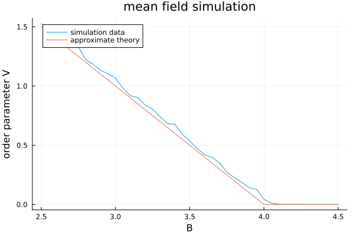

# Timeliness criticality

This repository contains the code necessary to reproduce the simulations shown in https://arxiv.org/abs/2309.15070 and discussed in https://arxiv.org/pdf/2307.03546. 

This code was generated by three authors:

    - José Moran (Julia code)
    - Deb Panja (C code)
    - Matthijs Romijnders (Python code)

## Julia code (used to determine critical buffers)

To run this in julia, you need to instantiate the project environment in your REPL. Change directories to `julia_temp_criticality` and run 

```julia

] activate .

```

You can then run the simulations in the jupyter notebook `julia_nb.ipynb`, or you can run the example script `example.jl` from the command line. 

```bash

julia --project example.jl

```

This will save a file `example.png` in the directory with a simulation run, which should look like this:




## C code (used to determine avalanche statistics)

To compile the C code, used for more heavy computations and in particular the avalanche simulations, `cd` into the `C` directory and run 

```bash
 gcc temporal_avalanches.c -o temporal_avalanches -lm -O2
```

this will create an executable `temporal_avalanches` which you can run with

```bash
./temporal_avalanches
```

which will then store files called `out` (containing the time-series), `avalanches` (containing avalanche sizes), `persistence` (containing the persistence times) and `correlations` (containing the time-series autocorrelation functions) in your working directory, from which probability distributions are determined.

Once we have data on probability distributions (such as `avalanches` and `persistence`), we can post-process them by pooling into logarithmic bins and doing an exponential smoothing (for plotting purposes) by running the following `awk` script:

```bash
awk '{obin=bin;bin=int(20*log($1));a[bin]+=$2;n[bin]++; if (obin!=bin) print exp(bin*0.05),a[bin]/n[bin];}' < datafile > datafile.smoothed
```

note that the `20` in the `awk` script is the number of bins per decade, and the `0.05` is the bin width in the original data. These scale factors can be freely chosen, but their product must equal `1`. This was used to produce e.g. Figure 5 in the "Timeliness Criticality" paper.


## Python code (used for temporal networks)
To be added.
